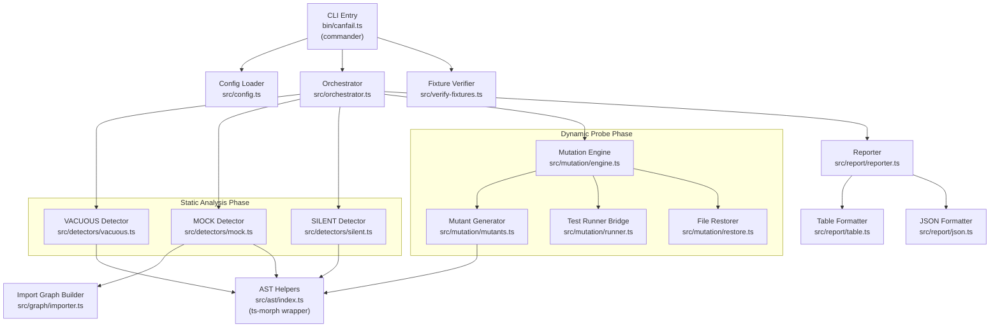

# Design: Vacuity Detection for canfail

## Architecture Overview

`canfail` is a pure local static-analysis and dynamic-mutation CLI. It never makes network calls. It operates in two phases: **static analysis** (VACUOUS, MOCK, SILENT detectors) and **dynamic probing** (SURVIVED detector). Both phases produce `Finding` objects that are collected and reported.



---

## Module Boundaries

| Module | Path | Responsibility |
|---|---|---|
| CLI entry | `bin/canfail.ts` | Parse argv with commander, invoke orchestrator or verify-fixtures |
| Config loader | `src/config.ts` | Read `canfail.config.ts` or fallback defaults, validate |
| Orchestrator | `src/orchestrator.ts` | Sequence detectors, collect findings, pass to reporter |
| VACUOUS detector | `src/detectors/vacuous.ts` | AST walk of test files, emit VACUOUS findings |
| MOCK detector | `src/detectors/mock.ts` | Import graph traversal from entry point, emit MOCK findings |
| SILENT detector | `src/detectors/silent.ts` | AST walk of source + test files, emit SILENT findings |
| Mutation engine | `src/mutation/engine.ts` | Coordinate probe lifecycle; owns the try/restore loop |
| Mutant generator | `src/mutation/mutants.ts` | Produce deterministic `Mutant[]` from a source AST node |
| Test runner bridge | `src/mutation/runner.ts` | Spawn test process in subprocess, capture pass/fail |
| File restorer | `src/mutation/restore.ts` | Snapshot and restore file content atomically |
| Import graph | `src/graph/importer.ts` | Build directed graph of TS/JS imports using ts-morph |
| AST helpers | `src/ast/index.ts` | Typed wrappers around ts-morph for common patterns |
| Reporter | `src/report/reporter.ts` | Route findings to the correct formatter |
| Table formatter | `src/report/table.ts` | Render human-readable table to stdout |
| JSON formatter | `src/report/json.ts` | Serialize `CanfailReport` to stdout |
| Fixture verifier | `src/verify-fixtures.ts` | Compare actual findings against planted-defects manifest |

---

## Data Model

### `Finding`

```typescript
type DetectorKind = "VACUOUS" | "SURVIVED" | "MOCK" | "SILENT";

type VacuousSubtype =
  | "no-assertion"
  | "tautological"
  | "empty-catch"
  | "skipped"
  | "snapshot-only"
  | "unreachable-assertion";

type MockSubtype = "identifier" | "hardcoded-sample";

type SilentSubtype = "success-on-error" | "health-check-swallow" | "empty-success";

interface Location {
  file: string;       // absolute path
  line: number;
  column: number;
}

interface Finding {
  id: string;                       // deterministic: sha1(kind+file+line)
  kind: DetectorKind;
  subtype?: VacuousSubtype | MockSubtype | SilentSubtype;
  location: Location;
  message: string;                  // human description
  chain?: string[];                 // MOCK: import path from entry point to offending module
  mutant?: MutantDescriptor;        // SURVIVED only
  suppressed: boolean;              // true if canfail-ignore present on the line
}

interface MutantDescriptor {
  mutation: MutationKind;           // "comparison-swap" | "boolean-flip" | "return-sentinel" | "conditional-negation"
  originalText: string;
  mutatedText: string;
  sourceFile: string;
  sourceLine: number;
}

interface Summary {
  total: number;
  byKind: Record<DetectorKind, number>;
  suppressed: number;
}

interface CanfailReport {
  version: string;          // semver of canfail
  timestamp: string;        // ISO 8601
  summary: Summary;
  findings: Finding[];
}
```

---

## Mutation-Probe Algorithm (SURVIVED Detector)

The mutation engine operates per **test file**. For each test file the algorithm is:

1. **Collect imports** — use `src/graph/importer.ts` to resolve all source files imported (directly or transitively) by the test file, excluding `node_modules` and type-only imports.

2. **Enumerate mutation targets** — for each source file in the import closure, use `src/mutation/mutants.ts` to walk the AST and produce a list of `MutationTarget` objects. A target is any node matching one of:
   - **comparison-swap**: binary expression where operator is `===`, `!==`, `<`, `>`, `<=`, `>=` → swap to the next operator in a fixed cycle.
   - **boolean-flip**: boolean literal `true` → `false` and vice versa.
   - **return-sentinel**: a `return <expr>` statement in a non-void function → `return "__canfail_sentinel__"`.
   - **conditional-negation**: the condition of an `if`, `while`, or ternary → wrap in `!( ... )`.

3. **Filter** — skip targets in `node_modules`, `.d.ts` files, and nodes annotated with `// canfail-no-mutate`.

4. **Probe loop** — for each `(sourceFile, target, mutation)` triple:
   a. **Snapshot** the source file content via `src/mutation/restore.ts`.
   b. **Apply** the mutation to the source file on disk.
   c. **Run** the specific test file in a child process via `src/mutation/runner.ts`. Use a 30-second wall-clock timeout.
   d. **Capture** the exit code of the test runner process. Exit code `0` = suite still green (mutant **survived**). Any non-zero = mutant **killed**.
   e. **Restore** the original file content unconditionally (success, failure, or timeout).
   f. If the mutant **survived**, emit a `Finding` with `kind: "SURVIVED"` and attach the `MutantDescriptor`.

5. **Deduplicate** — if the same `(sourceFile, sourceLine, mutation)` triple appears more than once (e.g. two test files cover the same source line), emit only one finding.

6. **Timeout handling** — if the test subprocess times out, treat it as a killed mutant (defensive: a hung test is evidence the mutation had an effect) and log a warning to stderr.

---

## Error Handling

| Scenario | Behaviour |
|---|---|
| Source file has a TypeScript parse error | Log warning to stderr with file path; skip file; continue |
| Test runner subprocess crashes (non-test-failure exit) | Log warning; treat as killed mutant (safe default) |
| Test runner subprocess times out | Log warning; treat as killed mutant |
| `package.json` not found | Fatal error with exit code `2` and message pointing user to run from project root |
| Entry point for MOCK detector is unresolvable | Warn on stderr; MOCK detector emits zero findings rather than aborting |
| File restore fails after mutation | Fatal error with exit code `2`; print original content to stderr so user can manually recover |
| Unknown CLI flag | Commander prints usage and exits with code `1` |
| `canfail.config.ts` exists but fails to compile | Fatal error with exit code `2` and the TypeScript diagnostic |

---

## Non-Goals

- `canfail` does **not** fix tests. It only reports.
- `canfail` does **not** make network calls. No telemetry, no remote APIs, no package registry checks.
- `canfail` does **not** support non-TypeScript/JavaScript files (e.g. Python, Rust).
- `canfail` does **not** perform full equivalence mutation testing (exhaustive mutant enumeration). It uses a fixed catalogue of four mutation kinds for speed.
- `canfail` does **not** integrate with specific test frameworks beyond running the test command as a subprocess. It delegates pass/fail detection entirely to the exit code of the configured test command.
- `canfail` does **not** auto-suppress findings. Suppression requires explicit `// canfail-ignore` inline comments in the source.
- `canfail` does **not** track finding history or trend across runs. It is a stateless gate.

---

## Testing Strategy

### Unit Tests (colocated with source)

Each detector module has a colocated `*.test.ts` file. Unit tests:
- Use **in-memory AST** constructed via ts-morph `createSourceFile` to avoid touching the filesystem.
- Assert the exact `Finding[]` array for a given synthetic source string.
- Cover the positive case (finding emitted), the negative case (no finding for valid code), and the suppression case (`canfail-ignore`).
- Are run with vitest and complete in under 5 seconds total.

### Integration Tests

- `tests/integration/` contains end-to-end tests that invoke the CLI as a subprocess (`execa`) against real fixture directories under `fixtures/`.
- The primary integration test runs `canfail verify-fixtures` against `fixtures/greenwashed-app` and asserts exit code `0`, proving the tool correctly identifies all planted defects.
- A second integration test runs `canfail` against `fixtures/clean-app` (a test suite with no vacuous checks) and asserts exit code `0` with zero findings.

### Fixture Integrity Test

- `tests/fixtures.test.ts` reads the planted-defects manifest (`fixtures/greenwashed-app/canfail-manifest.json`) and statically asserts that every manifest entry references a file that actually exists and a line that actually contains the planted defect. This prevents silent manifest rot.

### Mutation Engine Tests

- `src/mutation/engine.test.ts` uses a controlled fixture with a known mutation target and a spy on `runner.ts` to avoid spawning real subprocesses. Asserts correct restore behavior on both success and simulated failure paths.

### CI Gate

- The `canfail` tool runs against itself (its own `src/` directory) in CI to prevent the developers from shipping vacuous internal tests. This is the self-hosting gate.
