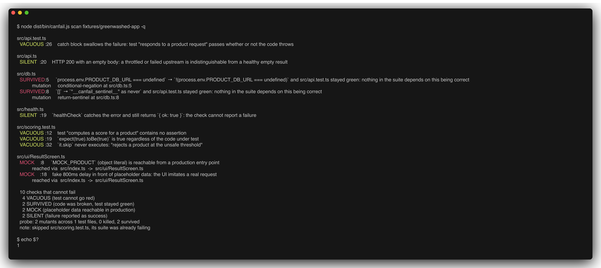
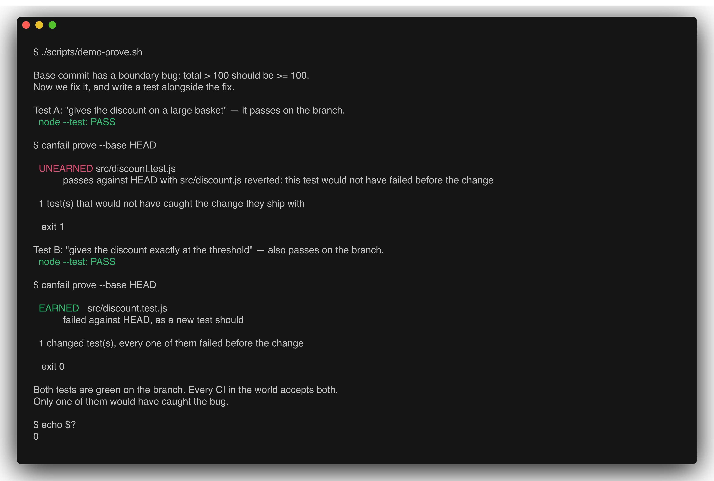
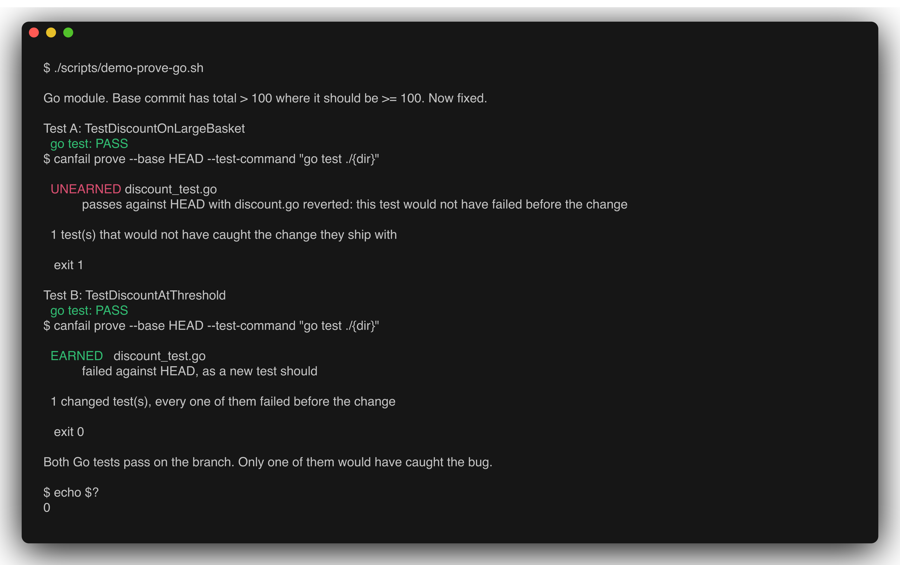
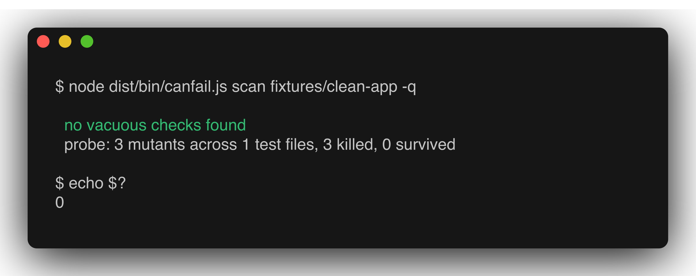
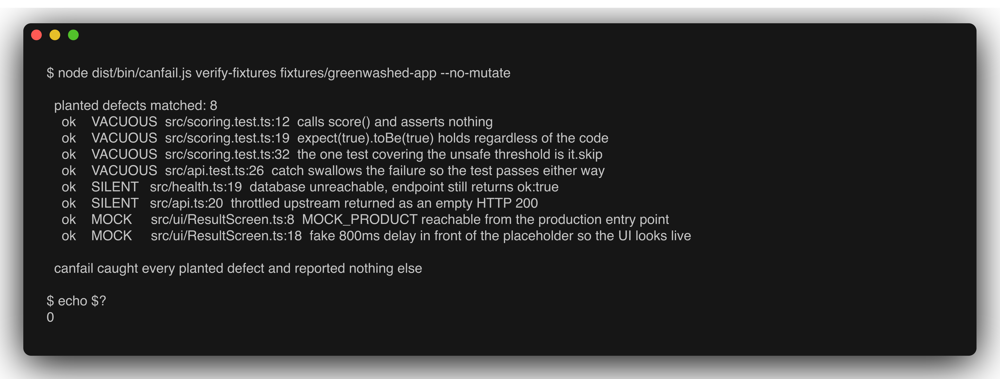
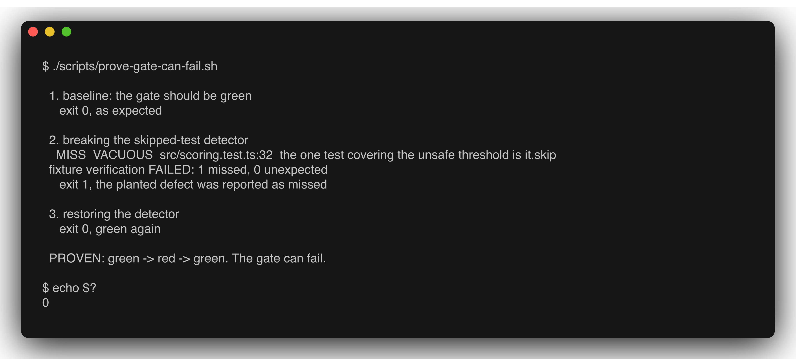

# canfail

**Your test suite is green. That is not the same as your tests being able to go red.**

`canfail` is a CLI and CI gate that finds checks which cannot fail: tests that assert nothing, tests that swallow the failure they were written to catch, health endpoints that report success while the dependency underneath is down, placeholder data sitting in a code path a real user can reach, and new tests that would have passed against the code they were written for.

The static detectors are TypeScript and JavaScript. `canfail prove` works in **any language whose tests live in their own files** — verified against Go, and TypeScript, in CI on every push.

It does not trust the green checkmark. For the tests that look real, it breaks the code they cover, re-runs them, and reports the ones that stayed green anyway.

```bash
canfail scan fixtures/greenwashed-app
```



Exit code `1`. That fixture app has a **100% passing test suite**.

> Every terminal image in this README is a real run captured by [`scripts/shots.sh`](scripts/shots.sh) with [freeze](https://github.com/charmbracelet/freeze). None are hand-edited or reconstructed, and each one shows its own exit code. Regenerate them yourself with `./scripts/shots.sh`.

---

## The problem this exists for

Coding agents are very good at producing a green test suite, because "make the tests pass" is the instruction. Nothing in that loop requires the test to have been capable of failing in the first place. The result is a specific, repeatable defect class that ordinary tooling cannot see: coverage is high, CI is green, the code is wrong, and nobody finds out until a user does.

Three real incidents that motivated each detector:

| What happened | Why nothing caught it | Detector |
|---|---|---|
| A mobile app went to store review rendering a hardcoded product record behind a fake 800ms delay. The scoring engine and datasets underneath were genuinely production quality, which is exactly why reading the service layer gave a false all-clear. | The mock was in the UI layer, reachable from the entry point. Reviewing services proved nothing about what the user sees. | `MOCK` |
| A nightly report printed `Cannot connect to database` in five consecutive sections and finished with **"Health score: 90/100. All checks OK."** | The health check caught the error and returned `ok: true`. The check ran, passed, and could not have failed. | `SILENT` |
| A throttled upstream returned HTTP 200 with an empty feed, byte-identical to a healthy account with no data. Downstream read it as "nothing new" for weeks. | 200 with an empty body is a success response. No assertion distinguishes "empty" from "broken". | `SILENT` |

And the general case, which is what `SURVIVED` is for: a test that calls the right function, asserts a real value, and still does not constrain the behaviour that matters. In the fixture, `verdictFor` decides whether a food product is safe for someone with an allergy. Its boundary comparison can be **inverted** and the suite stays green, because the only test that approached the threshold was `it.skip`.

## What it checks

| Detector | Finds | How |
|---|---|---|
| `VACUOUS` | tests that cannot go red | AST: no reachable assertion, tautologies (`expect(true).toBe(true)`), `catch {}` that swallows the failure, `.skip` / `.only`, snapshot-only tests, assertions reachable only on the throwing path |
| `SURVIVED` | tests that are green for the wrong reason | mutation probe: break a line the test imports, re-run only that test file, report if it stayed green |
| `MOCK` | placeholder data users can reach | import graph from the real entry point; a mock in `__mocks__` or a `.test.ts` is fine, a mock reachable from `src/index.ts` is a shipped lie. Reports the import chain. |
| `SILENT` | failures reported as success | AST: `return true` / `ok: true` / `200` from inside a `catch`, health checks that swallow, HTTP 200 with an empty body |
| `UNEARNED` | a new test that never could have failed | `canfail prove`: revert the changed source to its base revision, run the changed tests against that old code, require red |

`VACUOUS`, `MOCK` and `SILENT` are static and take under a second. `SURVIVED` runs your tests repeatedly and is the slow one; `--no-mutate` skips it. `UNEARNED` is a separate command because it needs git history.

**On prior art:** `expect-expect` and `no-disabled-tests` in [eslint-plugin-vitest](https://github.com/vitest-dev/eslint-plugin-vitest), and Biome's `noSkippedTests`, already cover four of the six `VACUOUS` subtypes, and [StrykerJS](https://stryker-mutator.io/) is a better mutation tester than this one. That is written out honestly in [PRIOR-ART.md](PRIOR-ART.md), along with the four things nothing else does. If you only read one section of this repo, read that one.

## canfail prove: the check no CI runs

Every CI system enforces that your tests **pass on the branch**. None enforces that a new test would have **failed on the base commit**.

That gap is exactly where AI-assisted development leaks: when the same session writes the fix and the test, the test tends to describe the implementation instead of pinning the behaviour. Green before the change, green after it. Coverage goes up. Nothing was constrained.

```bash
./scripts/demo-prove.sh     # builds a throwaway git repo in /tmp, touches nothing else
```

The base commit has an off-by-one: `total > 100` where it should be `>= 100`. The fix is applied, and two different tests are written alongside it. **Both pass on the branch.**



Every CI in the world accepts both. Only one of them would have caught the bug.

Source files are reverted with `git show`, and a file that did not exist at the base revision is moved aside rather than deleted, so an interrupted run never destroys new work. The working tree is restored on every path and verified afterwards.

### prove is not TypeScript-specific

The invariant needs three things: git history, a way to recognise a test file, and a command that exits non-zero when tests fail. None of that is tied to a language. The same binary checks a Go module:

```bash
./scripts/demo-prove-go.sh
```



Commands that need a package path rather than a file get `{dir}`; commands that need the file get `{file}`:

```bash
canfail prove --base main --test-command "go test ./{dir}"
canfail prove --base main --test-command "python -m pytest {file}"
canfail prove --base main --test-command "npx vitest run"        # path appended
```

**Support matrix — "verified" means exercised in CI on every push, not asserted:**

| | `prove` (UNEARNED) | `scan` (VACUOUS / SURVIVED / MOCK / SILENT) |
|---|---|---|
| TypeScript, JavaScript | **verified** — import-closure scoped | **verified** |
| Go | **verified** — real `go test` module in CI | not supported |
| Python (`test_*.py`, `*_test.py`) | pattern supported, **not verified** | not supported |
| Ruby (`*_spec.rb`, `*_test.rb`), Java (`*Test.java`) | pattern supported, **not verified** | not supported |
| Rust | `tests/*.rs` only — see below | not supported |

Two honest limits:

- **Rust unit tests cannot be checked.** Idiomatic Rust puts them in `#[cfg(test)] mod tests` inside the source file. Reverting that file to its base revision deletes the test being evaluated, so canfail detects this and skips with that reason printed rather than reporting a misleading pass. Integration tests under `tests/` work normally.
- **Only TypeScript and JavaScript get import-closure scoping.** Every other language reverts the whole changed surface of the same language, which is the stricter reading of the invariant — the test must fail against the change as a whole. Python, Ruby and Java are pattern-supported and have unit-tested detection, but no end-to-end run in CI, so they are listed as unverified.

The AST detectors do not port tonight. Writing a Go or Python parser for `VACUOUS` / `MOCK` / `SILENT` is real work and claiming it without a fixture would be exactly the defect this tool exists to catch.

## Quickstart

Requires Node 20+. No API keys, no network calls, no accounts. `canfail` never makes an outbound request.

```bash
git clone <this repo> && cd canfail
npm install
npm run build

# The demo. A fully green test suite with 13 planted defects.
npm run demo

# The negative case: a small module whose tests genuinely constrain it.
# Every mutant is killed, zero findings, exit 0.
npm run demo:clean

# The full test suite: 59 tests, including CLI integration tests
npm test

# The gate on your own project
node dist/bin/canfail.js scan /path/to/your/project --no-mutate
```



`fixtures/clean-app` matters as much as the broken one. A tool that reports findings everywhere is as useless as one that reports none; the clean fixture is the check that stops canfail from becoming a finding generator, and it runs in CI on every push.

### Verify the tool itself

A scanner that prints "0 problems" is indistinguishable from a scanner that is broken. `fixtures/greenwashed-app` ships with `canfail-manifest.json`, a catalogue of every defect deliberately planted in it. This command asserts that `canfail` finds **all of them and reports nothing else**:

```bash
npm run verify:fixtures
```



It exits `1` on a miss **and** on a false positive, so weakening a detector turns CI red.

### Prove the gate itself can fail

The same argument applies one level up: `verify-fixtures` passing is only meaningful if it is *capable* of failing. This script breaks a detector, asserts the gate goes red, restores it, and asserts it goes green again.

```bash
./scripts/prove-gate-can-fail.sh
```



### canfail scans canfail

Running the tool on its own source is not a stunt; it is the only honest way to ship it.

```bash
node dist/bin/canfail.js scan . --exclude fixtures
```

The first self-scan returned 23 findings. Two were **false positives in canfail itself**, and both are now fixed: pattern constants like `MOCK_ID_RE` were being reported as reachable mock data, and `catch` blocks that report through a callback were being read as silent swallows. Both fixes are in `src/detectors/mock.ts` and `src/detectors/silent.ts`, and `verify-fixtures` still matches 13/13 afterwards, which is exactly the regression the `.kiro` hook guards.

Six were genuine `SURVIVED` findings — real gaps in canfail's own test suite:

| Mutant that survived | What it proved was untested | Test added |
|---|---|---|
| `args.length === 0` negated in `vacuous.ts` | no test distinguished a literal expectation from a computed one | "does not flag a literal subject compared against a computed value" |
| `!matcher` negated in `vacuous.ts` | the zero-argument matcher path was unconstrained | "flags a literal subject with a zero-argument matcher" |
| `file.endsWith(".tsx")` negated in `mutants.ts` | `.tsx` files were parsed as plain TypeScript and nothing noticed | "parses a .tsx file as JSX rather than as plain TypeScript" |
| `snapshot()` return replaced with a sentinel in `restore.ts` | nothing asserted on what the guard hands back | "returns the original content from snapshot()" |

The suite went from 28 to 33 tests as a direct result. That is the tool doing its job on its author.

## Usage

```
canfail scan [path]                  scan a project (default command)
canfail verify-fixtures [path]       assert every planted defect in a manifest is caught

  --json                    machine-readable CanfailReport on stdout
  --no-mutate               static detectors only, skip the mutation probe
  --test-command <cmd>      command that runs one test file (inferred from package.json)
  --timeout <ms>            per-test-run timeout during probing        [30000]
  --max-mutants <n>         mutants attempted per test file            [12]
  --only <kinds>            VACUOUS,SURVIVED,MOCK,SILENT
  --max-findings <n>        gate threshold: fail above this many       [0]
  -q, --quiet               no progress output on stderr
```

Exit codes: `0` gate passed, `1` gate failed, `2` canfail could not run.

Suppress a deliberate case with `// canfail-ignore` on or above the line; exclude a line from mutation with `// canfail-no-mutate`. Suppressions are counted and printed, never silent.

### In CI

```yaml
- run: npm ci && npm run build
- run: node dist/bin/canfail.js scan . --no-mutate          # fast gate on every PR
- run: node dist/bin/canfail.js scan . --max-mutants 5      # nightly, with the probe
```

## How the mutation probe works

For each test file, in order:

1. Run the test file untouched. If it is already red, skip it: a failing suite proves nothing about mutants.
2. Resolve the first-party source files that test file transitively imports.
3. Generate mutants from a fixed catalogue: comparison swap (`>=` → `>`), boolean flip, return-sentinel, conditional negation. Deterministic and sorted, so two runs produce the identical list.
4. For each mutant: snapshot the file, apply the mutation to disk, re-run **only that test file**, restore the file unconditionally.
5. Exit code `0` from the test run means the mutant survived: nothing in the suite depended on that line being correct.

**Restoration is a hard invariant, and it has one hole that no in-process code can close.** Files are restored on success, on failure, on timeout, on `SIGINT` and on `SIGTERM`. After the loop, `canfail` re-reads every touched file against its snapshot and aborts with exit code `2` rather than leave mutated source on disk.

`SIGKILL` cannot be trapped. **This bit this repo.** While generating the README images, the screen-capture tool hit its own timeout and SIGKILLed canfail mid-probe. No handler ran, `fixtures/greenwashed-app/src/scoring.ts` was left with `containsAllergen` returning `"__canfail_sentinel__"`, and it went into a commit. It surfaced three commits later as a CI failure that looked like something else entirely — a green-looking local run, a broken artifact, exactly the defect class this tool is named after.

Two fixes, both in the repo:

1. **A crash journal.** Before a file is mutated, its original bytes are copied to `.canfail-backup/` and recorded in `.canfail-journal.json`. Every subsequent run reads the journal *before anything else* and repairs the tree, then reports what it repaired. If a backup is missing it says so and keeps the journal rather than claiming success. `tests/integration/crash-recovery.test.ts` spawns a real probe, **SIGKILLs it**, asserts the tree is genuinely dirty, and requires the next run to restore it byte-for-byte.
2. **A commit guard.** [`scripts/no-mutants-committed.sh`](scripts/no-mutants-committed.sh) fails when a mutation artifact is tracked by git. It runs first in CI. Re-staging the original mutant makes it exit 1; removing it makes it exit 0.

The honest version of the invariant: canfail cannot guarantee it is never killed mid-mutation, so it guarantees the damage is recorded, repaired on the next run, and blocked at the commit.

A timeout counts as a **killed** mutant, not a survivor. A hung test is evidence the mutation had an effect, and the conservative direction is to under-report.

## Architecture

```
bin/canfail.ts            CLI, exit codes
src/orchestrator.ts       sequences detectors, assembles the report
src/detectors/
  vacuous.ts              VACUOUS   (static, AST)
  mock.ts                 MOCK      (static, import graph)
  silent.ts               SILENT    (static, AST)
src/mutation/
  mutants.ts              deterministic mutant catalogue
  engine.ts               probe loop, dedupe, budget
  runner.ts               spawns the test command, reads the exit code
  restore.ts              snapshot / restore / verifyClean
src/graph/importer.ts     import resolution, reachability, shortest import chain
src/report/table.ts       human output
src/verify-fixtures.ts    manifest comparison
fixtures/greenwashed-app  a green suite with 13 planted defects
```

`canfail` is framework-agnostic by construction. It never parses test-runner output; pass/fail is the subprocess exit code and nothing else. That is why it works with vitest, jest, mocha, and `node --test` without adapters.

## How Kiro was used

This project was specified before it was written, and the specs are in the repo.

**Spec-driven development** — `.kiro/specs/vacuity-detection/`
- `requirements.md`: 7 user stories, 28 numbered acceptance criteria in EARS syntax (`WHEN … THEN the system SHALL …`). Every detector behaviour traces to one.
- `design.md`: the mermaid architecture diagram, the module boundary table, the `Finding` / `MutantDescriptor` / `CanfailReport` interfaces implemented verbatim in `src/types.ts`, the six-step probe algorithm, an eight-row error-handling table, and seven explicit non-goals.
- `tasks.md`: 20 checkboxed implementation tasks, each carrying a `_Requirements: x.y_` back-reference.

The traceability is real and load-bearing: the header of each detector cites the criteria it implements (`vacuous.ts` → Requirements 2.1–2.6, `mock.ts` → 4.1–4.4, `silent.ts` → 5.1–5.4, `engine.ts` → 3.1–3.7). Design decisions that survived into the code unchanged include the unconditional-restore rule (3.5), treating a timeout as a killed mutant (3.6), and the per-test mutant budget (3.7).

**A second spec, written honestly** — `.kiro/specs/unearned-tests/`
- `canfail prove` was built *before* its spec, during a prior-art review late in the day. The spec exists now — 5 user stories, 22 EARS criteria, 20 tasks — and its first section is a `## Provenance` note stating plainly that this feature was not spec-first, unlike the other one. Recording that is worth more than a spec set that pretends.

**Steering** — `.kiro/steering/`
- `product.md`: what canfail is, four target personas, non-goals.
- `tech.md`: Node 20+, ESM, TypeScript strict, ts-morph for AST work, and three hard constraints Kiro enforced across every file it touched: **no network calls, no paid APIs, no untrusted code execution**.
- `structure.md`: directory layout, naming conventions, and the import-boundary rules between modules.

**Agent hooks** — `.kiro/hooks/verify-fixtures-on-detector-change.json`
- `verify-fixtures-on-detector-change`: on saving anything under `src/detectors/` or `src/mutation/`, re-run fixture verification. A detector edit that stops catching a planted defect is exactly the regression this project exists to prevent, so it is caught at save time rather than in review.
- `spec-traceability-reminder`: on saving a detector, an agent action checks the file against `requirements.md` and flags emitting behaviour that no acceptance criterion covers.

**What Kiro was not used for.** The four detector heuristics and the mutation catalogue were designed by hand, because they encode judgement about which patterns are false positives. Kiro wrote the spec set, the steering docs, and drove the implementation against them.

## What is real, and what is not

Stated plainly, because a tool about honest verification should be honest about itself.

**Exercised and verified in this repo:**
- All four detectors run against `fixtures/greenwashed-app` and produce the 13 findings above, matched one-for-one against the manifest.
- The mutation probe genuinely mutates files on disk and re-runs vitest as a subprocess: 7 mutants, 2 killed, 5 survived on the fixture.
- Working-tree restoration after a full probe is verified byte-for-byte with checksums.
- 59 tests: unit tests for every detector subtype, the mutant generator, the file guard, the import graph, and the test-runner bridge, plus 12 CLI integration tests that run the built binary as a subprocess and assert its exit codes.

**Known limits:**
- TypeScript and JavaScript only.
- The probe budget is per test file (`--max-mutants`, default 12), so a full run is a sample of the mutation space, not an exhaustive one. Surviving mutants are proof of a gap; the absence of them is not proof of coverage.
- Import resolution is file-based: it follows relative imports and does not resolve `tsconfig` path aliases or bare package specifiers. A project that reaches its UI exclusively through an alias will under-report `MOCK`.
- The `MOCK` detector is heuristic on naming (`MOCK_`, `demoUser`, …). A placeholder named `realProductData` will not be flagged.
- `SILENT` detects the syntactic shapes above, not semantic swallowing in general.
- Only the first mutant per source line is attempted, to spread the budget across lines rather than concentrating it.

## License

MIT. See `LICENSE`.
